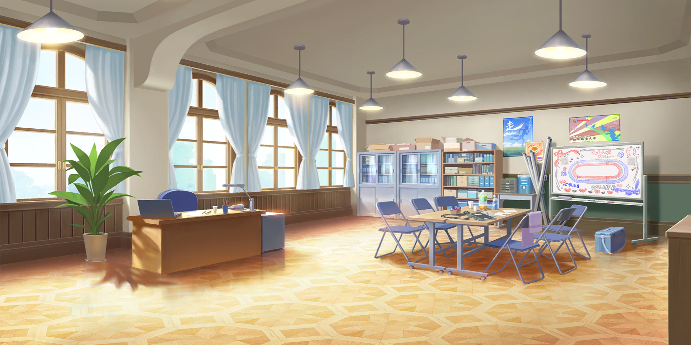
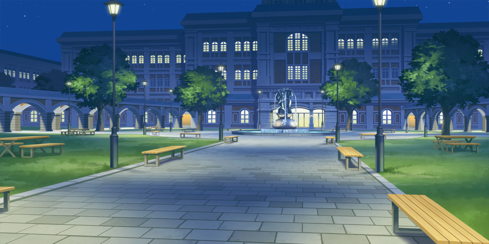
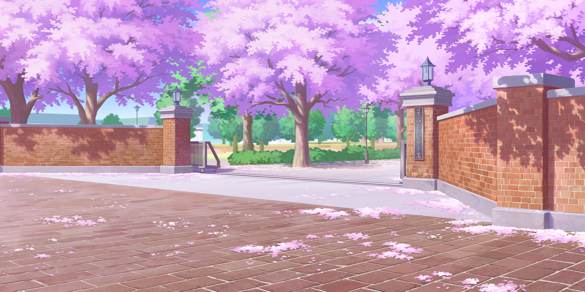

# UmusumeBackgroundExporter v1

A tool to export Umamusume: Pretty Derby background assets (such as Tracen Academy background you see when you're doing career)

Special thanks to [AssetTools.NET](https://github.com/nesrak1/AssetsTools.NET)

Current features are:
 - Exporting backgrounds from JP Umamusume
 
## Examples

